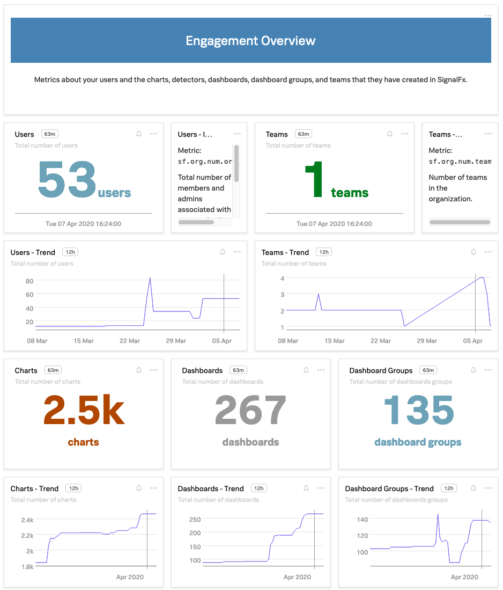
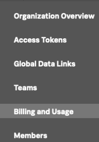
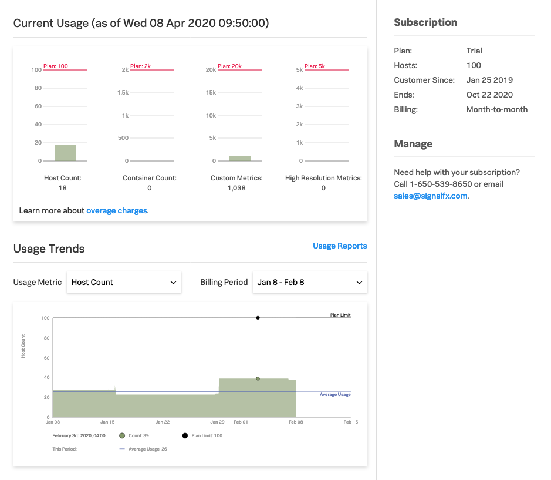
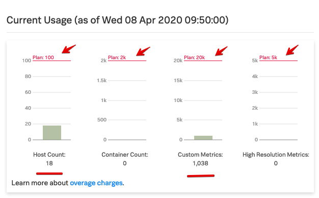
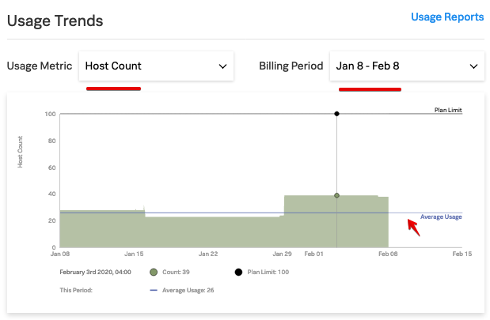
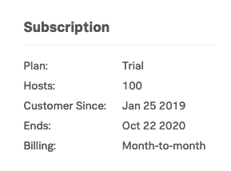

# Service Bureau - Lab Summary

* How to keep track of the usage of SignalFx in your organization
* Learn how to keep track of spend by exploring the Billing and Usage interface
* Creating Teams
* Adding notification rules to Teams
* Controlling Team usage

---

## 1. Understanding SignalFx engagement

To fully understand SignalFx engagement inside your organization, click on the **Settings** icon on the top right of the SignalFx UI.

It may also look like this 

From the drop down, select the **Organizations Settings → Organization Overview**, this will provide you with the following dashboard that shows you how your SignalFx organization is being used:

On the left hand menu (not shown in the above screenshot) you will see a list of members, and in the centre, various charts that show you the number of users, teams, charts, dashboards, and dashboard groups created, as well as various growth trends.

The screenshot is taken from an demonstration organization, the Workshop organization you're looking at may have less data to work with as this is cleared down after each workshop.

Take a minute to explore the various charts in the Organization Overview of this Workshop instance.

---

## 2. Usage and Billing

If you want to see what your usage is against your contract you can select the **Organizations Settings → Billing and Usage** from your profile icon top right of the SignalFx UI.

Or the faster way is to select the **Billing and Usage** item from the left hand pane.

This screen may take a few seconds to load whilst it calculates and pulls in the usage.

---

## 3. Understanding usage

You will see a screen similar like the one below that will give you an overview of the current usage, the average usage and your entitlement per category : Hosts, Containers, Custom Metrics and High Resolution Metrics.  

For more information about about these categories please refer to [Billing and Usage information](https://docs.signalfx.com/en/latest/admin-guide/usage.html#viewing-billing-and-usage-information){: target=_blank}.

---

## 4. Examine usage in detail

The top chart shows you the current subscription levels per category (shown by the red arrows at the top in the screenshot below).

Also, your current usage of the four catagories is displayed (shown at the red lines at the bottom of the chart).

In this example you can see that there are 18 Hosts, 0 Containers and 1038 Custom Metrics and 0 High Resolution Metrics.

In the bottom chart, you can see the usage per category for the current period (shown in the drop-down box on the top right of the chart).

The blue line marked **Average Usage** indicates what SignalFx will use to calculate your average usage for the current billing period.

!!! info

    As you can see from the screenshot, SignalFx does not use High Watermark or P95% for cost calculation but the actual average hourly usage, allowing you to do performance testing or Blue/Green style deployments etc. without the risk of overage charges.

To get a feel for the options you can change the metric displayed by selecting the different options from the **Usage Metric** drop down on the left, or change the the **Billing Period** with the drop down on the right.

Please take a minute to explore the different time periods & categories and their views.

Finally, the pane on the right shows you information about your Subscription.

